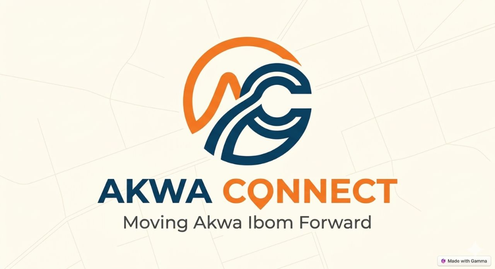

<div align="center">
  
</div>

<h1 align="center">Akwa Connect</h1>

<p align="center">
  <strong>Smarter Mobility for Akwa Ibom</strong> <br />
  A modern, high-performance web application designed to revolutionize public transportation with real-time tracking, seamless digital wallet integration, and intelligent route planning.
</p>

<p align="center">
  <a href="#features"><strong>Features</strong></a> ·
  <a href="#tech-stack"><strong>Tech Stack</strong></a> ·
  <a href="#getting-started"><strong>Getting Started</strong></a> ·
  <a href="#architecture"><strong>Architecture</strong></a> ·
  <a href="#contributing"><strong>Contributing</strong></a>
</p>

<div align="center">
  
  
  
  
</div>

<br />

## 🚀 Overview

**Akwa Connect** is the central digital hub for modern commuters in Akwa Ibom. Built with cutting-edge web technologies, it provides a comprehensive end-to-end transportation ecosystem. Whether it's finding the fastest route, tracking a bus in real-time, or topping up a travel wallet, Akwa Connect handles everything within a lightning-fast, intuitive interface.

## ✨ Key Features

- **📍 Real-Time Tracking:** Live bus geolocation and accurate ETAs using real-time data streams.
- **💳 Digital Wallet:** Seamlessly top-up travel cards and pay fares cashless.
- **🗺️ Intelligent Routing:** Interactive system maps powered by dynamic UI elements for optimal travel routes.
- **📱 Responsive & Native Feel:** A PWA-ready architecture delivering a mobile-first, app-like experience right in the browser.
- **💫 Fluid Animations:** Cinematic page transitions and micro-interactions powered by `framer-motion`.

## 🛠 Tech Stack

Akwa Connect leverages a modern, lightweight, and blazingly fast stack:

- **Frontend Framework:** React 19
- **Build Tool:** Vite
- **Styling:** Vanilla CSS (Custom Design System, CSS Variables)
- **Animations:** Framer Motion
- **Icons:** Lucide React
- **Utilities:** clsx

## 🏁 Getting Started

To get a local copy up and running, follow these simple steps.

### Prerequisites

- [Node.js](https://nodejs.org/en/) (v18 or higher recommended)
- `npm`, `yarn`, or `pnpm`

### Installation

1. **Clone the repository**
   ```bash
   git clone https://github.com/dollarsmoney/AWKA-CONNECT.git
   cd AWKA-CONNECT
   ```

2. **Install dependencies**
   ```bash
   npm install
   ```

3. **Start the development server**
   ```bash
   npm run dev
   ```

4. Open `http://localhost:5173` in your browser to see the application.

## 📂 Architecture & Project Structure

The project follows a component-centric architecture, ensuring modularity, reusability, and clean separation of concerns.

```text
├── public/                 # Static assets (images, videos, metadata)
├── src/
│   ├── components/         # Reusable UI components
│   │   ├── AppExperience.jsx # Mobile app showcase
│   │   ├── Features.jsx      # Core value propositions
│   │   ├── Hero.jsx          # Dynamic landing page hero
│   │   ├── Navigation.jsx    # Sticky, responsive navbar
│   │   └── SystemMap.jsx     # Interactive transit map
│   ├── App.jsx             # Root application component
│   ├── index.css           # Global CSS variables and design tokens
│   └── main.jsx            # Application entry point
├── package.json            # Project dependencies and operational scripts
└── vite.config.js          # Vite build configuration
```

## 🤝 Contributing

Contributions are what make the open source community such an amazing place to learn, inspire, and create. Any contributions you make are **greatly appreciated**.

1. Fork the Project
2. Create your Feature Branch (`git checkout -b feature/AmazingFeature`)
3. Commit your Changes (`git commit -m 'Add some AmazingFeature'`)
4. Push to the Branch (`git push origin feature/AmazingFeature`)
5. Open a Pull Request

## 📄 License

Distributed under the MIT License. See `LICENSE` for more information.

---

<p align="center">
  Built with ❤️ for better mobility in Akwa Ibom.
</p>
